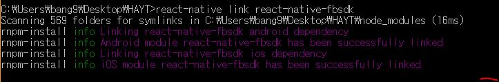
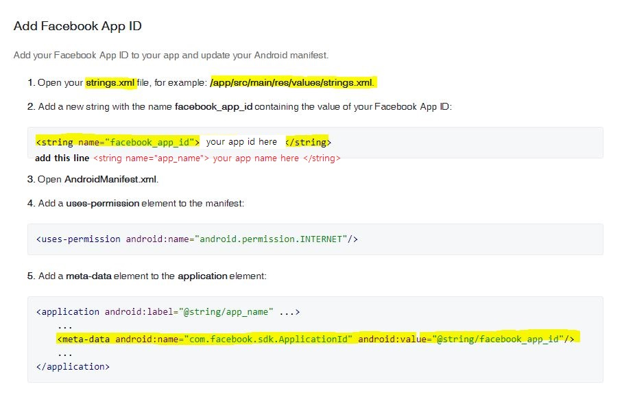
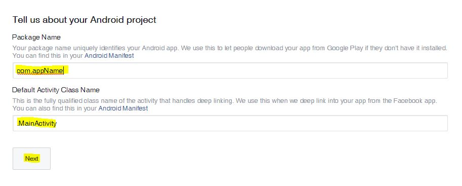
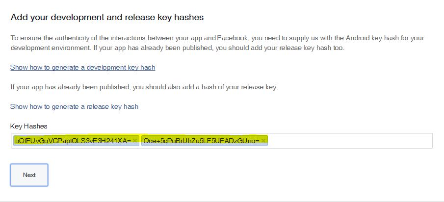

<h1>facebook-login-examples</h1>
 

### STEP1. Install react-native-fbsdk
    npm install --save react-native-fbsdk@0.6.0
> ###### _react-native-fbsdk@0.6.1 an error occured when linking_

 

***

 

### STEP2. Linking

    react-native link react-native-fbsdk

 

***

 

### STEP3. Setting for using Facebook SDK
> **First, you make your facebook app and following this**  
> * Facebook Developers (https://developers.facebook.com/quickstarts/?platform=android)  

  
  
  

 

***

 

### STEP4. Use and test this examples
* You can get fb_auth data(token) using **LoginManager**  
* You can get users data(birth,gender,name ...) using **Graph** with token
